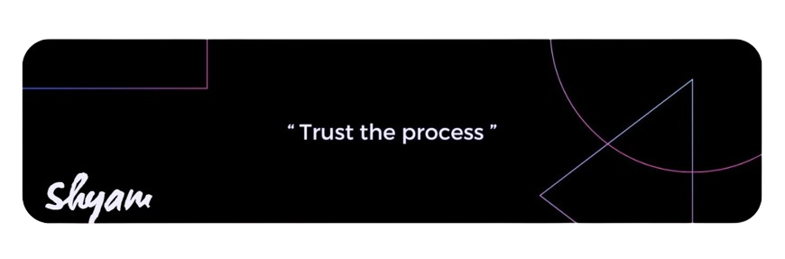

<body style="font-family: Arial, sans-serif; line-height: 1.6; margin: 20px;">
    
<h1 style="color: #333;">About Me 👨‍💻</h1>

    
Hello! I'm Shyam Sankar M, passionate on Coding enthusiast from Coimbatore, India. Currently, I'm pursuing my B.E. in Computer Science at Dr. NGP Institute of Technology with a 70 % grade . My journey into the world of technology started early and has been enriched by my academic endeavors and hands-on experiences in the field of Front End dev.

    
  <h2 style="color: #333;">🎓 Education</h2>
    <ul>
        <li><strong>B.E. in Computer Science</strong> | DR.N.G.P. Institute of Technology (2021 - Present)</li>
        <li><strong>HSC in Computer Science</strong> | Sambaviga Hr. Sec. School (2019 - 2021)</li>
    </ul>
    

    
  <h2 style="color: #333;">🛠️ Skills</h2>
    <ul>
        <li><strong>Programming Languages:</strong> Java,Html ,css </li>
        <li><strong>Libraries/Frameworks:</strong>Javascript, React JS, Bootstrap</li>
        <li><strong>Tools/Platforms:</strong> Adobe Photoshop, Figma , Canva , Git(Version Control)</li>
    </ul>
    
  <h2 style="color: #333;">📜 Certifications</h2>
    <ul>
        <li>MongoDB with NodeJS - Verzeo</li>
        <li>Java - SkillUp</li>
        <li>Front-End Web Development Essentials - DevTown (GDSC KIIT Chapter)</li>
        <li>HTML, CSS, React, PHP, JS, Bootstrap - Udemy</li>
        <li>Front End Apps with React Js - YardStick</li>
    </ul>
    <h2 style="color: #333;">🎯 Career Objective</h2>
  
"Aspire to secure a challenging position in Computer Science as a CSE Student , utilizing my technical skills and creativity to develop innovative software solutions."

    
  <h2 style="color: #333;">📞 Contact</h2>
    <ul>
        <li><strong>Email:</strong> shyamsankar3100@gmail.com</li>
        <li><strong>Phone:</strong> +91 6382844553</li>
        <li><strong>Location:</strong> Coimbatore - 641048</li>
    </ul>
    
  
Let's connect and collaborate on GitHub! ✌️

</body>

